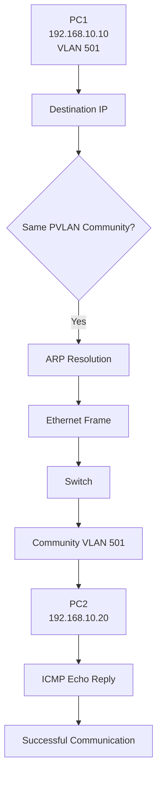
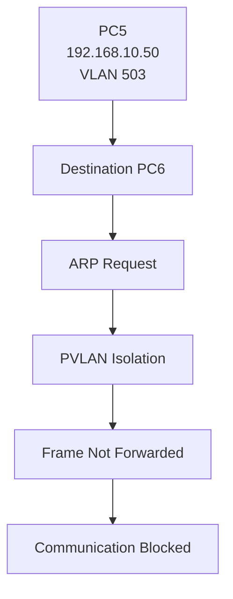
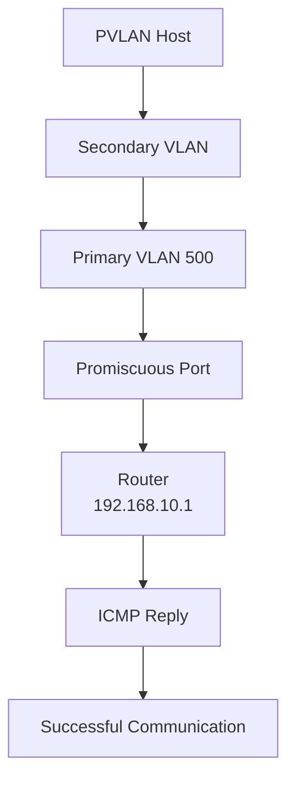

# 🧪 Private VLAN (PVLAN) Lab

## 🎯 Objective

Configure and verify Cisco Private VLANs (PVLANs) using:

- Primary VLAN
- Community VLANs
- Isolated VLAN
- Promiscuous port

This lab demonstrates how Private VLANs provide **Layer 2 host isolation** while still allowing hosts to communicate with a common Layer 3 gateway.

---

## 🖥️ Topology

```text
                         Router
                     192.168.10.1
                          |
                    Promiscuous Port
                       VLAN 500
                          |
                       SW1
          ________________|________________
         |                |                |
         |                |                |
   Community 1       Community 2        Isolated
     VLAN 501          VLAN 502          VLAN 503
     |     |           |     |           |     |
   PC1   PC2          PC3   PC4         PC5   PC6
   .10   .20          .30   .40         .50   .60
````

---

## 🌐 IP Addressing

| Device | PVLAN | IP Address    | Subnet Mask | Role        |
| ------ | ----: | ------------- | ----------- | ----------- |
| Router |   500 | 192.168.10.1  | /24         | Promiscuous |
| PC1    |   501 | 192.168.10.10 | /24         | Community   |
| PC2    |   501 | 192.168.10.20 | /24         | Community   |
| PC3    |   502 | 192.168.10.30 | /24         | Community   |
| PC4    |   502 | 192.168.10.40 | /24         | Community   |
| PC5    |   503 | 192.168.10.50 | /24         | Isolated    |
| PC6    |   503 | 192.168.10.60 | /24         | Isolated    |

**Default Gateway:** `192.168.10.1`

---

## 🏗️ Private VLAN Design
<br>


### Primary VLAN

```text
VLAN 500
```

The primary VLAN is the main VLAN associated with the secondary VLANs.

### Community VLANs

```text
VLAN 501 → Community 1
VLAN 502 → Community 2
```

Hosts within the **same community VLAN** can communicate with each other.

```text
PC1 VLAN 501  <---->  PC2 VLAN 501
       ✅ Communication

PC3 VLAN 502  <---->  PC4 VLAN 502
       ✅ Communication
```

Hosts belonging to **different community VLANs** are isolated from each other.

```text
VLAN 501  ✖  VLAN 502
```

### Isolated VLAN

```text
VLAN 503
```

Hosts in the isolated VLAN cannot communicate directly with other isolated or community hosts.

```text
PC5 VLAN 503  ✖  PC6 VLAN 503
PC5 VLAN 503  ✖  VLAN 501
PC5 VLAN 503  ✖  VLAN 502
```

However, isolated hosts can communicate with the **promiscuous port**, such as the router.

```text
PC5 VLAN 503  --->  Router
PC6 VLAN 503  --->  Router
```

---

## 🔧 Technologies

* Cisco IOS
* Private VLAN (PVLAN)
* Primary VLAN
* Community VLAN
* Isolated VLAN
* Promiscuous Port
* IPv4
* Ethernet
* ARP
* ICMP
* Layer 2 Segmentation

---

## ⚙️ PVLAN Configuration


### 1. Create Primary VLAN

```cisco
vlan 500
 private-vlan primary
 private-vlan association 501,502,503
```

### 2. Create Community VLANs

```cisco
vlan 501
 private-vlan community

vlan 502
 private-vlan community
```

### 3. Create Isolated VLAN

```cisco
vlan 503
 private-vlan isolated
```

---

## 🔌 Configure Host Ports

### Community VLAN 501

```cisco
interface range g0/0-1
 switchport mode private-vlan host
 switchport private-vlan host-association 500 501
```

### Community VLAN 502

```cisco
interface range g0/2-3
 switchport mode private-vlan host
 switchport private-vlan host-association 500 502
```

### Isolated VLAN 503

```cisco
interface range g1/0-1
 switchport mode private-vlan host
 switchport private-vlan host-association 500 503
```

---

## 🌐 Configure Promiscuous Port

The router-facing interface is configured as a **promiscuous port**.

```cisco
interface g1/2
 switchport mode private-vlan promiscuous
 switchport private-vlan mapping 500 501
 switchport private-vlan mapping 500 502
 switchport private-vlan mapping 500 503
```

The promiscuous port can communicate with hosts belonging to all associated secondary VLANs.

---

## 🔍 Verify PVLAN Configuration

### Display PVLANs

```cisco
show vlan private-vlan
```


# 📊 Communication Testing

## Test 1 — Same Community VLAN

PC1:

```text
192.168.10.10
```

PC2:

```text
192.168.10.20
```


Both hosts belong to **Community VLAN 501**.

```text
PC4 VLAN 501
     |
     | ICMP
     ↓
PC4 VLAN 501
```

### Result

```text
PC4 → PC3
✅ Successful
```

---


## Test 2 — Same Community VLAN


Both hosts belong to **Community VLAN 502**.

### Result


---

## Test 3 — Isolated VLAN

PC8:

```text
192.168.10.50
```

PC7:

```text
192.168.10.60
```

Both hosts belong to **Isolated VLAN 503**.

### Result

```text
PC8 → PC7
❌ Blocked
```

Even though both hosts are in the same IP subnet, the PVLAN configuration prevents direct Layer 2 communication.

---


## Test 4 — Host to Router

All hosts use:

```text
Default Gateway: 192.168.10.1
```

### Results
Here I present ouput of only PC8->router but in lab all PC reach Router
<br>
```text
PC1 → Router
✅ Successful

PC2 → Router
✅ Successful

PC3 → Router
✅ Successful

PC4 → Router
✅ Successful

PC5 → Router
✅ Successful

PC8 → Router
✅ Successful


```


This demonstrates the purpose of the **promiscuous port**.

---

# 🔄 Communication Process

## Same Community Communication



---

## Isolated Host Communication



---

## Host-to-Router Communication



---

# 🧠 PVLAN Communication Model

```text
                 Primary VLAN 500
                        |
          +-------------+-------------+
          |             |             |
      Community      Community      Isolated
        501             502            503
       /   \           /   \          /   \
     PC1   PC2       PC3   PC4      PC5   PC6

      ↕                 ↕              X
   Allowed           Allowed       Blocked
```


# ✅ Result

The Private VLAN configuration was successfully implemented and verified.

The lab demonstrated:

* Community-to-community communication within the same secondary VLAN
* Isolation between different community VLANs
* Complete Layer 2 isolation of isolated ports
* Communication between secondary VLANs and the promiscuous router port
* PVLAN-based segmentation within the same IP subnet

---

# 📚 Key Learning

* Private VLAN architecture
* Primary VLAN
* Secondary VLAN
* Community VLAN
* Isolated VLAN
* Promiscuous port
* PVLAN host association
* PVLAN mapping
* Layer 2 host isolation
* ARP behavior with PVLANs
* ICMP connectivity testing
* Cisco IOS PVLAN configuration
* Enterprise network segmentation


